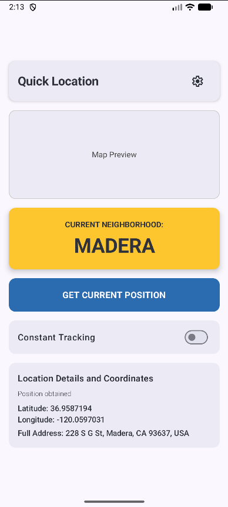
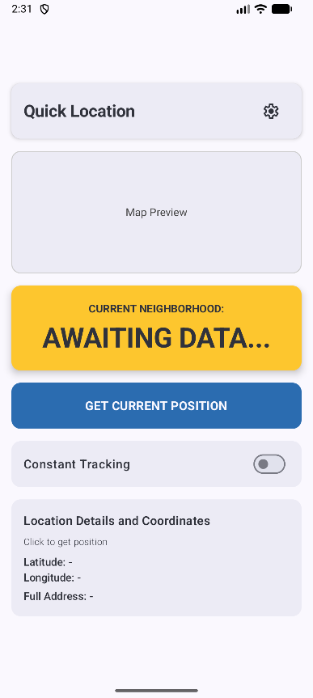

# 📍 GeoTactical


> GeoTactical is an Android application built with **Jetpack Compose** to quickly obtain the **current neighborhood** during patrol, pursuit, or tactical operations.  
> Designed for scenarios where location information must be immediate, precise, and highly visible.

<p align="center">
  
  
</p>

---

## 🎯 Improvements & Roadmap

The project is still under active development. Upcoming updates include:

- [x] Highlighted current neighborhood
- [x] Instant location retrieval
- [x] Continuous tracking (1-second interval)
- [x] Full address, latitude, longitude
- [x] Dedicated permission screen
- [ ] Maps integration
- [ ] Dark Mode
- [ ] Configurable update interval

---

## 🚀 Installing GeoTactical

Clone the repository:

```bash
git clone https://github.com/devLusk/GeoTactical.git
```

---

## ☕ Using GeoTactical

After installing:

```text
1. Open the app
2. Grant Location permission
3. View the current neighborhood highlighted on the screen
4. Enable/disable continuous tracking as needed
```

The app displays:

- Current neighborhood
- Latitude & longitude
- Full address
- Live updates every second (if tracking is enabled)